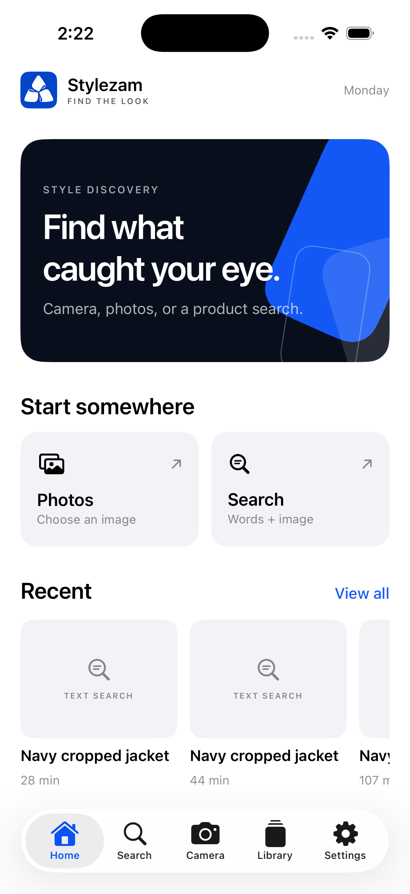
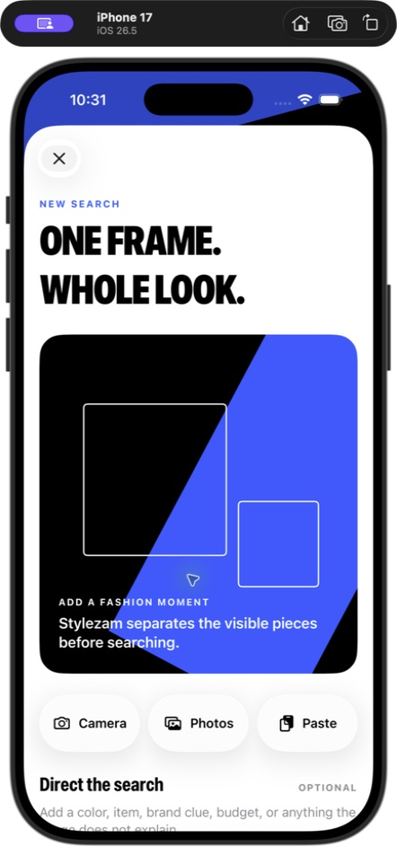
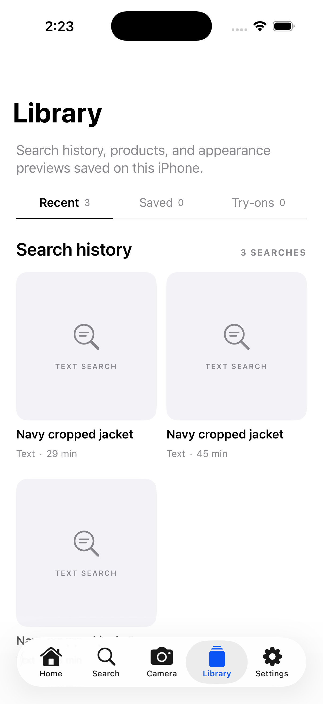

<p align="center">
  
</p>

<h1 align="center">Stylezam</h1>

<p align="center">
  <strong>Capture a look. Separate the pieces. Keep what matters.</strong><br>
  A native iPhone fashion-capture app with fully on-device garment detection and segmentation.
</p>

<p align="center">
  
  
  
  
</p>

Stylezam keeps fashion detection local. Its RF-DETR Core ML model is included in the app, compiled by Xcode, and loaded directly on the iPhone. Capture, live boxes, garment crops, diagnostic masks, duplicate filtering, and Library storage do not require a cloud host, a laptop acting as a server, an API token, or a first-run model download.

Product retrieval is real and explicitly user-triggered. One tap makes one visual-provider request for one selected garment; that single request can return several products. Developer Debug can pin an eligible preferred provider and uses an eligible fallback when that preference cannot accept the current local crop. Lykdat and Google Cloud Vision Web Detection can receive the private crop bytes directly. Google returns matching pages and images rather than guaranteed store listings, so Stylezam preserves that evidence and leaves unavailable prices empty. SearchAPI.io, SerpApi, and Bright Data become eligible only when their credential and required public-crop configuration are both present. Fireworks Qwen 3.7 Plus powers a persistent, image-aware conversation for each garment using schema-constrained responses. The explicit **Find similar** and **Find cheaper** chat actions generate grounded shopping terms and then perform one real Serper keyword-shopping query; cheaper results with comparable currencies are ordered from lower to higher price. Result cards show currency-formatted prices and a match percentage. No sample products, simulated progress, or invented prices are used.

Photo-based virtual try-on is also real and explicitly user-triggered. A product result or saved Library piece can be sent with a user-selected photo to YouCam's category-specific clothes, bag, scarf, shoes, hat, ring, bracelet, earring, watch, or necklace endpoint. The in-app try-on camera opens front-facing and uses a visible three-second timer so the user can step back before capture. Completed previews are downloaded into the local Library.

The app now opens with a focused four-page first-run experience and requires Google Sign-In through Firebase Authentication. Display-name, username, style note, captures, crops, and Library state remain local to the iPhone. Firebase stores the authentication identity and delivers a signed `developer` custom claim; no Firestore profile database is used. Free is active with 10 product searches and 20 AI questions per month. Plus and Pro are pricing previews only—there is no checkout, payment simulation, or paid entitlement in this build.

## Current system

| Area | Status | Boundary |
|---|---|---|
| iPhone support | iOS 18–27 | Liquid Glass is used on iOS 26+; native compatibility styling is used on iOS 18–25. |
| Live screen | iOS 27 + iOS 27 SDK build | The phone OS alone is insufficient; the installed app must be rebuilt with Xcode 27/ScreenCaptureKit. |
| Camera | Photo + hybrid Live, portrait + landscape | Live inference pauses under serious thermal pressure; the manual shutter remains available. |
| Local vision | Bundled Core ML, no download | Fashionpedia item taxonomy; diagnostic masks are not presented as final cutouts. |
| Product search | Real provider responses | One provider request per successful garment search by default; up to six deduplicated products shown. |
| Virtual try-on | Real YouCam V2 tasks | Separate Outfit, Hand/Wrist, and Face/Neck contexts; every upload requires explicit consent. |
| AI | Persistent Fireworks Qwen chat + Serper shopping | Similar and cheaper actions are explicit; Fireworks does not power the main visual-search button. |
| Accounts | Firebase Google Sign-In | Profile data stays local; developer access requires a signed Firebase custom claim. |
| Payments | Free plan active | Plus and Pro are previews only; no checkout exists in this build. |

## Quick start

```bash
./scripts/check.sh
./scripts/generate_project.sh
open Stylezam.xcodeproj
```

Local camera detection and the Library need no API key or server. Google Sign-In
does require the private local Firebase client configuration described in
[`docs/SETUP.md`](./docs/SETUP.md). If another developer is joining the project,
use the exact tracked/private file checklist in
[`docs/TEAMMATE_HANDOFF.md`](./docs/TEAMMATE_HANDOFF.md); do not send a zip of a
working directory containing ignored credentials.

## What works now

- Custom full-screen camera with rear/front switching, flash, Photo mode, hybrid Live mode, and orientation-correct portrait/landscape capture.
- Five-page editorial first-run experience, animated launch branding with YouCam attribution, required Firebase Google sign-in, local editable profile, role badge, logout, and account restoration.
- Free membership enforcement plus non-purchasable Plus/Pro preview cards; verified Developer claims receive unlimited internal usage.
- Automatic Live capture after a stable, high-quality frame, plus a manual shutter at any time. Live mode draws provisional boxes immediately, confirms labels across consecutive frames, explains the current capture state, and saves a full-resolution still after consensus.
- Bundled 61.7 MB FP16 Core ML garment-segmentation package—no setup download.
- On-device boxes, Fashionpedia item classes, readable box crops, and inspectable raw instance masks.
- Accepted 1080p–5K photos keep up to 5120 px of source detail for crops. Still photos combine one 384×384 global prediction with bounded overlapping detail tiles, reaching about 686 px effective detector detail at 1080p and about 1029 px at 4K–5K without changing the fixed model tensor.
- Up to five pieces per look by default; Developer Debug can raise the limit to 12.
- Real Vision Inspector with source overlays, crop previews, normalized geometry, confidence, byte counts, and measured local inference time.
- Crop-first local Library containing detected pieces, capture source, timestamp, and multi-select deletion. Live Screen entries store the confirmed garment crop instead of the full display or Dynamic Island.
- One-successful-search-per-garment safety ledger by default. Failed provider attempts remain in diagnostics but are retryable and do not consume the garment or membership allowance.
- Preferred visual-provider routing: one request at a time to the selected eligible provider, with a visible eligible fallback when the preference cannot accept the crop.
- Direct Lykdat and Google Cloud Vision Web Detection retrieval, plus persistent per-garment Fireworks Qwen image chat and explicit Fireworks → Serper similar/cheaper shopping paths.
- Google requests contain one image and exactly one `WEB_DETECTION` feature. A non-increasable, separately persisted 1,000-unit monthly counter reserves a unit before networking and survives diagnostic-history clearing.
- SearchAPI.io, SerpApi, and Bright Data adapters with truthful eligibility checks, local monthly limits, result caps, latency, outcomes, and request diagnostics.
- Result normalization that ranks provider evidence, groups repeated regional/store listings, and labels results as visual alternatives rather than claiming SKU identity.
- Explicit deletion for captures and completed match history.
- Durable scan memory shared by front/rear Live camera and Live Screen. Perceptual hashes plus compact Vision/fallback visual signatures persist with each local piece, survive relaunches, and are forgotten when the capture is deleted.
- Photo import, clipboard input, Share extension, App Intents, separate Capture a Look and Live Screen Control Center controls, two-observation automatic Live Screen detection, Live Activities, and animated Dynamic Island recognition/cropping/saved state.
- iOS 18–27 runtime compatibility. Xcode 27 builds include the conditional iOS 27 ScreenCaptureKit adapter; camera, import, clipboard, Share, and Screenshot Shortcut remain available on earlier systems. The typed Control Center controls require iOS 26, and Live Screen itself requires iOS 27. Verification and device-install scripts reject an older SDK so Live Screen cannot silently disappear from a replacement build.
- Photo try-on workspace for clothes, bags, scarves, shoes, hats, rings, bracelets, earrings, watches, and necklaces, with an in-app front/rear camera, Photos import, selectable Library pieces, connection checks, actionable API errors, and saved results.
- Every detected piece in Library Recent links directly into its saved-or-live provider search with prices, and can also be sent straight to the Try On rail as a local crop.
- Developer Debug can pin visual discovery to a preferred eligible provider; unavailable choices fall back without changing the saved preference.

<table>
  <tr>
    <td width="33%" align="center"></td>
    <td width="33%" align="center"></td>
    <td width="33%" align="center"></td>
  </tr>
</table>

## Architecture

```mermaid
flowchart LR
    Input["Camera · Photos · Clipboard · Share · Screen"] --> Normalize["Orientation and bounded image normalization"]
    Normalize --> Model["Bundled RF-DETR Core ML"]
    Model --> Select["Confidence · item classes · IoU suppression · item cap"]
    Select --> Crops["Readable bounding-box crops"]
    Select --> Masks["Raw diagnostic masks"]
    Crops --> Library["Local Library"]
    Crops --> Inspector["Local Vision Inspector"]
    Masks --> Inspector
    Crops --> Choice["User selects one piece"]
    Choice --> Meter["Reserve one request"]
    Meter --> Router["Preferred eligible provider · safe fallback"]
    Router --> Direct["One visual-provider request"]
    Choice --> Chat["Persistent Stylezam AI chat"]
    Chat --> Qwen["Fireworks Qwen vision + conversation"]
    Qwen --> Refine["Find similar · Find cheaper"]
    Refine --> Serper["One keyword shopping query"]
    Direct --> Rank["Normalize · rank · group duplicates"]
    Rank --> Matches["Real visual matches"]
    Serper --> Matches
    Matches --> Library
    TryOn["Selected photo + product images"] --> YouCam["YouCam photo try-on"]
    YouCam --> Library
```



Live camera preview downsizes sampled frames to a 1280 px long edge, encodes directly with Core Image, discards late frames, and runs one prediction with short temporal consensus. It does not create crops or run detail tiles. Two unchanged empty results move the camera to a 2.4-second retry cadence; a visual change or detected garment immediately restores fast confirmation. After an automatic save, a small whole-frame fingerprint suppresses repeated inference until the view changes. Full-frame preview work is paused while AVFoundation captures and analyzes the accepted quality-prioritized still. Live Screen runs one cheap global tensor immediately on newly sampled content instead of waiting for a Reel or page to become perfectly still. If that pass is empty and the next content fingerprint agrees, one crop-free global-plus-detail discovery finds small products on tall pages; following observations use a single focused tensor. Two agreeing garment observations trigger the full-quality capture. Captured and known-empty screens then enter a low-frequency watch state until their content changes. Before either Live path saves, Stylezam compares the crop with durable Library signatures so the same item is not added again after a relaunch or across camera/screen sources. Developer Debug always retains only the latest authorized Live Screen frame in memory and shows its real boxes, preview crops, saved crops, confidence, and pipeline counters. Dynamic Island and Live Activity transition through watching, scanning, recognized, cropping, and saved feedback; a completed scan also requests success feedback. Both live paths stop automatic inference at serious/critical thermal pressure; Live Screen slows in Low Power Mode. Accepted Photo, camera, and screen images retain up to a 5120 px long edge and use a global prediction plus thermal-aware square detail tiles. Already-upright camera JPEGs pass through without a decode/render/re-encode cycle. Every prediction still uses the model's fixed 384×384 tensor; detections are merged in source coordinates and projected onto the high-resolution source as 94%-quality JPEG crops. Diagnostic masks are generated only in Vision Inspector. Core ML is cached after first load. This model currently uses Core ML's CPU path on iOS because the GPU/Neural Engine path returned zero class logits during device validation. See [Architecture](./docs/ARCHITECTURE.md), [Model decision](./docs/MODEL_DECISION.md), [Privacy](./docs/PRIVACY.md), [Vision benchmark](./docs/VISION_BENCHMARK.md), and the [full validation report](./docs/VISION_VALIDATION.md).

## Bundled model

The selected artifact is `resoa/garment-detector-seg`, an RF-DETR-Seg-Small checkpoint converted to FP16 Core ML at 384 × 384. The exact source revision, checkpoint SHA-256, compiled-input/output contract, class order, license declarations, and each package-file hash are recorded in `App/Resources/Models/garment-segmentation.json`.

The item taxonomy covers core clothing, shoes, bags/wallets, hats/head coverings, glasses, ties, gloves, watches, belts, socks/stockings, scarves, and umbrellas. Fashionpedia does not provide reliable item classes for rings, bracelets, necklaces, or earrings, so this build does not pretend those classes are solved.

## Build and verify

```bash
./scripts/check.sh
```

The check verifies every bundled model file against its published byte count and SHA-256, regenerates the Xcode project, builds all iOS targets for the simulator, and proves the resulting `Stylezam.app` contains both the compiled `.mlmodelc` and its manifest.

For development and a connected iPhone:

```bash
cp .env.example .env
# Add only private developer provider keys; users never enter keys in the app.
chmod 600 .env
./scripts/install_on_device.sh
```

Or build manually:

```bash
./scripts/generate_project.sh
open Stylezam.xcodeproj
```

Choose your Development Team and run the `Stylezam` scheme. A free Personal Team can install the main app for seven-day testing, subject to Apple’s capability and provisioning limits. See [Setup](./docs/SETUP.md).

## Repository map

```text
App/Resources/Models/  bundled Core ML package and verified manifest
App/                    SwiftUI app, camera, local vision runtime, and Library
Extensions/Share/       image/text Share extension
Extensions/Widgets/     Control Widget, Live Activity, and Dynamic Island UI
Shared/                 App Group, App Intents, and activity attributes
Config/                 Fashionpedia class ordering and build configuration
docs/                   architecture, setup, teammate handoff, privacy, benchmark, and design notes
scripts/                project generation, model research/export, and verification
```

## Known release boundaries

- Provider settings in the app are status-only. Private Debug launches import ignored `.env` values into the device-only Keychain; users never paste service keys. Public distribution still requires a server-side credential broker so provider secrets are not shipped to customers.
- Lykdat and Google Cloud Vision Web Detection accept private crop bytes. Google Web Detection returns pages and matching/similar images; it is not Google Shopping and does not guarantee a product page or price. SearchAPI.io and SerpApi Google Lens connections work with a public HTTPS image URL, but Stylezam does not silently publish a private iPhone crop.
- Stylezam's Google Vision counter is a conservative device-side safety stop, not a Google Cloud project billing control. Restrict the key to Cloud Vision and the `com.stylezam.app` iOS bundle, monitor the Cloud project, and keep unrelated Vision use out of the same allowance.
- Google requires Cloud Billing on the key's project before it will execute Vision requests. The first 1,000 monthly feature units are listed as free, but a billing-enabled project is still a prerequisite.
- The configured Bright Data API authenticates, but the current zone returns an inner Google Lens HTTP 502 response. Treat it as unavailable until Bright Data confirms Lens access for that zone.
- Fireworks Qwen structured multi-turn chat and Serper shopping were verified separately against their live APIs; Fireworks is not used by the main exact visual-search button.
- Prices are current provider observations, not tracked price history.
- YouCam photo try-on requires network access, explicit per-session upload consent, an eligible YouCam account, and category-compatible source/reference photos.
- Transparent masks from the current Core ML export are diagnostic-only on iOS; Library deliberately stores the reliable bounding-box crop instead of presenting a broken cutout as final output.
- The deployment target is iOS 18 and the app runs on iOS 18–27. Live Screen is compiled by the iOS 27 physical-device SDK; Apple omits ScreenCaptureKit from the simulator SDK. The real Control Center `OpenIntent` handoff is automated, and Apple's real sharing picker is verified on the connected iOS 27 iPhone. Stream authorization still requires the user to tap Apple's consent action. Once authorized, Stylezam keeps scanning complete background frames locally and automatically persists a garment after two agreeing observations; it never starts a paid search automatically. Older systems keep camera, Photos, clipboard, Share, Screenshot Shortcut, and normal capture entry points.
- Physical-device camera performance, thermals, Live Activity, extensions, and App Group provisioning must be tested with the final signing team.
- App Store privacy disclosures and model/dataset legal review remain release tasks.

Stylezam source is licensed under [Apache License 2.0](./LICENSE). Model, dataset, and platform notices are in [THIRD_PARTY_NOTICES.md](./THIRD_PARTY_NOTICES.md).
