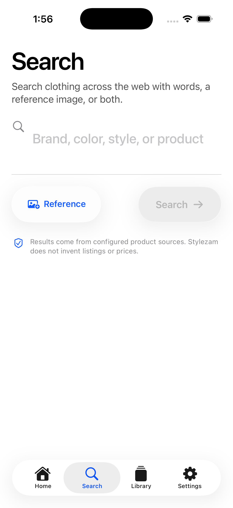
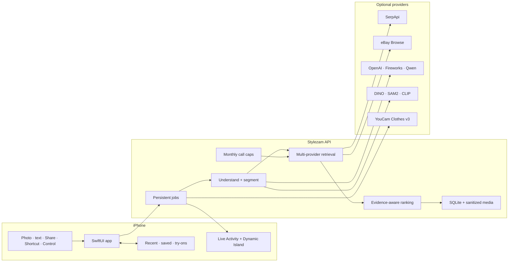

<p align="center">
  
</p>

<h1 align="center">Stylezam</h1>

<p align="center">
  <strong>Find what they’re wearing.</strong><br>
  Native fashion discovery for iPhone—identify a look from a photo, search with words and references, compare source-backed matches, and try products on.
</p>

<p align="center">
  
  
  
  
</p>

<p align="center">
  <a href="./docs/SETUP.md"><strong>Get started</strong></a> ·
  <a href="./docs/ARCHITECTURE.md">Architecture</a> ·
  <a href="./docs/PROVIDERS.md">Providers</a> ·
  <a href="./docs/PRIVACY.md">Privacy</a>
</p>

<br>

<table>
  <tr>
    <td width="33%" align="center">
      
    </td>
    <td width="33%" align="center">
      
    </td>
    <td width="33%" align="center">
      
    </td>
  </tr>
  <tr>
    <td align="center"><sub><strong>Home</strong> starts with one original photo-first capture surface</sub></td>
    <td align="center"><sub><strong>Search</strong> combines a query with an optional reference image</sub></td>
    <td align="center"><sub><strong>Library</strong> keeps recent searches, saved products, and try-ons local</sub></td>
  </tr>
</table>

The interface is deliberately content-first. Liquid Glass is reserved for Apple’s native tab bar, navigation, floating search composer, and primary media controls; it is not used as decoration on content cards. Determinate work uses the native linear `ProgressView`, system lists power Settings, and motion is short, interruptible, and Reduce Motion aware. The screenshots above come from the verified iPhone 17 simulator build.

## Fashion search without invented answers

Stylezam turns a fashion moment into evidence you can inspect. It analyzes the item, searches real product sources, removes duplicate listings, and ranks the remaining matches by visual, textual, and upstream evidence. Every result keeps its merchant link and an honest confidence label.

| Capture anywhere | Understand the look | Find real products | Try it on |
| --- | --- | --- | --- |
| Camera, Photos, clipboard image, text, Share sheet, Shortcut, Control Center, and Action Button | Whole-look detection, selectable item regions, hosted structured visual attributes, and optional local segmentation | Backend-managed retrieval with evidence-aware ranking and direct merchant URLs | User-initiated YouCam AI Clothes v3 previews, clearly presented as visualization—not fit prediction |

No generated listings. No invented prices. No affiliate redirects disguised as matches.

## From moment to match

1. **Capture or search** — start with a photo, screenshot, shared image, or typed product query.
2. **Choose** — search the full look or select a detected jacket, bag, shoe, or other region.
3. **Retrieve** — query configured image and text search providers under backend-enforced monthly caps.
4. **Compare** — review deduplicated offers, evidence tiers, observed prices, and source links.
5. **Keep or try** — save the result locally or create an optional virtual try-on.

Search progress follows you through a Live Activity and Dynamic Island. Live screen capture is intentionally not a permanent tab: iOS 27 uses Apple’s system picker, while iOS 26 supports a Screenshot Shortcut and the normal capture routes.

## Architecture



The iOS client is native SwiftUI. The FastAPI service owns provider credentials, durable job state, media sanitation, quota enforcement, and result normalization. See the full [architecture and search lifecycle](./docs/ARCHITECTURE.md).

## Provider stack

Stylezam is useful with a small stack and expands without changing the app:

| Capability | Recommended provider | Role |
| --- | --- | --- |
| Shopping + visual retrieval | SerpApi | Google Shopping and Lens results through a fixed monthly plan |
| Secondary text/image retrieval | eBay Browse | Real marketplace listings and Base64 image search |
| Hosted image understanding | OpenAI, Fireworks, or Qwen | Factual structured attributes with per-provider monthly hard stops |
| Local detection and reranking | Grounding DINO, SAM2, CLIP | Optional object regions, masks, and visual similarity |
| Virtual try-on | YouCam AI Clothes v3 | On-demand clothing visualization from a person photo |

Every external route has a configurable calendar-month cap. Missing providers are reported as unavailable; the app never fills the result screen with sample products. Review configuration and limits in [Providers](./docs/PROVIDERS.md).

## Run it locally

You need macOS with Xcode 26 or later and Python 3.9 or later.

### 1. Start the API

```bash
./scripts/bootstrap_backend.sh
cp backend/.env.example backend/.env
./scripts/run_backend.sh
```

The API starts at `http://127.0.0.1:8000`. Add at least one retrieval provider to `backend/.env` for product results. Interactive OpenAPI documentation is available at `/docs`.

### 2. Open the iPhone app

```bash
./scripts/generate_project.sh
open Stylezam.xcodeproj
```

The simulator can reach the default loopback API. A physical iPhone needs an HTTPS deployment, a development tunnel, or a backend address reachable from the phone. Follow the [device and signing checklist](./docs/SETUP.md) before running on hardware.

## Project map

```text
App/                    iPhone features, networking, and design system
Extensions/Share/       image and text Share extension
Extensions/Widgets/     Control Widget, Live Activity, and Dynamic Island
Shared/                 app-group data, App Intents, and activity attributes
backend/                FastAPI service, providers, persistence, and tests
docs/                   architecture, setup, privacy, UI, and provider notes
design-concepts/        product direction and app-icon explorations
project.yml             XcodeGen source of truth
render.yaml             production deployment blueprint
```

## Verify the complete project

```bash
./scripts/check.sh
```

This runs the backend test suite, regenerates the Xcode project, and builds all three iOS targets for the simulator with code signing disabled.

## Current release boundary

This repository is a functional first version, not a production App Store release. Before TestFlight, replace the placeholder signing identifiers, configure the App Group and development team, deploy an authenticated HTTPS backend, complete provider privacy disclosures, and test camera, Share, Control Center, Dynamic Island, deletion, product links, and YouCam on physical devices. The iOS 27 screen-capture path also requires Xcode 27 and device validation.

## License

Stylezam is available under the [Apache License 2.0](./LICENSE).
