<p align="center">
  
</p>

<h1 align="center">Stylezam</h1>

<p align="center">
  <strong>Capture a look. Separate the pieces. Keep what matters.</strong><br>
  A native iPhone fashion-capture app with fully on-device garment detection and segmentation.
</p>

<p align="center">
  
  
  
  
</p>

Stylezam keeps fashion detection local. The RF-DETR Core ML model is included in the application, compiled by Xcode, and loaded directly on the iPhone. Capture, boxes, garment crops, diagnostic masks, duplicate filtering, and Library storage do not require a cloud host, local computer, API token, or first-run model download.

Product retrieval is real and explicitly user-triggered. The main Search button sends one selected crop directly to Lykdat Global Search by default. Fireworks Qwen 3.7 Plus is reserved for the visible Stylezam AI chat and for user-requested similar-search refinements, which perform one Serper shopping query. Direct adapters are also included for SearchAPI.io Google Lens, SerpApi Google Lens, and Bright Data. No sample products, simulated progress, or invented prices are used.

The app now opens with a focused five-page first-run experience and requires Google Sign-In through Firebase Authentication. Display-name, username, style note, captures, crops, and Library state remain local to the iPhone. Firebase stores the authentication identity and delivers a signed `developer` custom claim; no Firestore profile database is used. Free is active with 10 product searches and 20 AI questions per month. Plus and Pro are pricing previews only—there is no checkout, payment simulation, or paid entitlement in this build.

## Quick start

```bash
./scripts/check.sh
./scripts/generate_project.sh
open Stylezam.xcodeproj
```

Local camera detection and the Library need no API key or server. Google Sign-In
does require the private local Firebase client configuration described in
[`docs/SETUP.md`](./docs/SETUP.md). If another developer is joining the project,
use the exact tracked/private file checklist in
[`docs/TEAMMATE_HANDOFF.md`](./docs/TEAMMATE_HANDOFF.md); do not send a zip of a
working directory containing ignored credentials.

## What works now

- Custom full-screen camera with rear/front switching, flash, Photo mode, and hybrid Live mode.
- Animated five-page first-run experience, required Firebase Google sign-in, local editable profile, role badge, logout, and account restoration.
- Free membership enforcement plus non-purchasable Plus/Pro preview cards; verified Developer claims receive unlimited internal usage.
- Automatic Live capture after a stable, high-quality frame, plus a manual shutter at any time. Live mode draws provisional boxes immediately, confirms labels across consecutive frames, explains the current capture state, and saves a full-resolution still after consensus.
- Bundled 61.7 MB FP16 Core ML garment-segmentation package—no setup download.
- On-device boxes, Fashionpedia item classes, readable box crops, and inspectable raw instance masks.
- Accepted 1080p–5K photos keep up to 5120 px of source detail for crops. Still photos combine one 384×384 global prediction with bounded overlapping detail tiles, reaching about 686 px effective detector detail at 1080p and about 1029 px at 4K–5K without changing the fixed model tensor.
- Up to five pieces per look by default; Developer Debug can raise the limit to 12.
- Real Vision Inspector with source overlays, crop previews, normalized geometry, confidence, byte counts, and measured local inference time.
- Local Library containing the source look, detected pieces, capture source, and timestamp.
- One-successful-search-per-garment safety ledger by default. Failed provider attempts remain in diagnostics but are retryable and do not consume the garment or membership allowance.
- Direct Lykdat visual retrieval by default, plus a separate Fireworks Qwen image chat and Fireworks → Serper AI-guided similar-search path.
- Developer-selectable Lykdat, SearchAPI.io, SerpApi, and Bright Data adapters with Keychain credentials, local monthly limits, result caps, latency, outcomes, and request diagnostics.
- Explicit deletion for captures and completed match history.
- Duplicate suppression for recent Live and screen captures.
- Photo import, clipboard input, Share extension, App Intents, separate Capture a Look and Live Screen Control Center controls, Live Activities, and Dynamic Island state.
- Conditional iOS 27 ScreenCaptureKit adapter; iOS 26 continues to support camera, import, clipboard, and Share input.

<table>
  <tr>
    <td width="33%" align="center"></td>
    <td width="33%" align="center"></td>
    <td width="33%" align="center"></td>
  </tr>
</table>

## Architecture

```mermaid
flowchart LR
    Input["Camera · Photos · Clipboard · Share · Screen"] --> Normalize["Orientation and bounded image normalization"]
    Normalize --> Model["Bundled RF-DETR Core ML"]
    Model --> Select["Confidence · item classes · IoU suppression · item cap"]
    Select --> Crops["Readable bounding-box crops"]
    Select --> Masks["Raw diagnostic masks"]
    Crops --> Library["Local Library"]
    Crops --> Inspector["Local Vision Inspector"]
    Masks --> Inspector
    Crops --> Choice["User selects one piece"]
    Choice --> Meter["Persist request reservation"]
    Meter --> Direct["Lykdat visual search by default"]
    Choice --> Chat["Stylezam AI question"]
    Chat --> Qwen["Fireworks Qwen vision"]
    Qwen --> Refine["Optional user-approved refinement"]
    Refine --> Serper["One Serper shopping query"]
    Direct --> Matches["Real product matches"]
    Serper --> Matches
    Matches --> Library
```



Live preview uses a bounded 1600 px source, one prediction, a 0.42 provisional confidence threshold, cross-label overlap filtering, and short temporal consensus; it does not create crops or run extra model passes. After automatic consensus, AVFoundation captures a full-quality still. Accepted Photo and Live images are decoded at up to 5120 px and use a global prediction plus thermal-aware square detail tiles. Every prediction uses the model's fixed 384×384 tensor; detections are merged in source coordinates and projected onto the high-resolution source as 94%-quality JPEG crops. The accepted-image scheduler has a 9-second internal budget, disables detail tiles in Low Power Mode, reduces them under fair thermal pressure, and stops them under serious or critical pressure. Screen capture remains single-pass. Diagnostic masks are generated only when Vision Inspector is open. Core ML is cached after first load. This model currently uses Core ML's CPU path on iOS because the GPU/Neural Engine path returned zero class logits during device validation. See [Architecture](./docs/ARCHITECTURE.md), [Model decision](./docs/MODEL_DECISION.md), [Privacy](./docs/PRIVACY.md), [Vision benchmark](./docs/VISION_BENCHMARK.md), and the [full validation report](./docs/VISION_VALIDATION.md).

## Bundled model

The selected artifact is `resoa/garment-detector-seg`, an RF-DETR-Seg-Small checkpoint converted to FP16 Core ML at 384 × 384. The exact source revision, checkpoint SHA-256, compiled-input/output contract, class order, license declarations, and each package-file hash are recorded in `App/Resources/Models/garment-segmentation.json`.

The item taxonomy covers core clothing, shoes, bags/wallets, hats/head coverings, glasses, ties, gloves, watches, belts, socks/stockings, scarves, and umbrellas. Fashionpedia does not provide reliable item classes for rings, bracelets, necklaces, or earrings, so this build does not pretend those classes are solved.

## Build and verify

```bash
./scripts/check.sh
```

The check verifies every bundled model file against its published byte count and SHA-256, regenerates the Xcode project, builds all iOS targets for the simulator, and proves the resulting `Stylezam.app` contains both the compiled `.mlmodelc` and its manifest.

For development and a connected iPhone:

```bash
cp .env.example .env
# Add local developer provider keys; .env is ignored and must remain private.
chmod 600 .env
./scripts/install_on_device.sh
```

Or build manually:

```bash
./scripts/generate_project.sh
open Stylezam.xcodeproj
```

Choose your Development Team and run the `Stylezam` scheme. A free Personal Team can install the main app for seven-day testing, subject to Apple’s capability and provisioning limits. See [Setup](./docs/SETUP.md).

## Repository map

```text
App/Resources/Models/  bundled Core ML package and verified manifest
App/                    SwiftUI app, camera, local vision runtime, and Library
Extensions/Share/       image/text Share extension
Extensions/Widgets/     Control Widget, Live Activity, and Dynamic Island UI
Shared/                 App Group, App Intents, and activity attributes
Config/                 Fashionpedia class ordering and build configuration
docs/                   architecture, setup, teammate handoff, privacy, benchmark, and design notes
scripts/                project generation, model research/export, and verification
```

## Known release boundaries

- Search credentials in Developer Debug are for a private developer build. Public distribution requires a server-side credential broker so provider secrets are not shipped to customers.
- Lykdat is the only currently verified direct provider that accepts private crop bytes. SearchAPI.io and SerpApi Google Lens connections work with a public HTTPS image URL, but Stylezam does not silently publish a private iPhone crop.
- The configured Bright Data API authenticates, but the current zone returns an inner Google Lens HTTP 502 response. Treat it as unavailable until Bright Data confirms Lens access for that zone.
- Fireworks Qwen chat and Serper shopping are verified as separate services; Fireworks is not used by the main exact visual-search button.
- Prices are current provider observations, not tracked price history. Virtual try-on remains deferred.
- Transparent masks from the current Core ML export are diagnostic-only on iOS; Library deliberately stores the reliable bounding-box crop instead of presenting a broken cutout as final output.
- The conditional iOS 27 screen path is not compiled by the installed Xcode 26.6 / iOS 26.5 SDK. Install Xcode 27, regenerate the project, and complete a physical-device verification pass before claiming screen recognition support.
- Physical-device camera performance, thermals, Live Activity, extensions, and App Group provisioning must be tested with the final signing team.
- App Store privacy disclosures and model/dataset legal review remain release tasks.

Stylezam source is licensed under [Apache License 2.0](./LICENSE). Model, dataset, and platform notices are in [THIRD_PARTY_NOTICES.md](./THIRD_PARTY_NOTICES.md).
