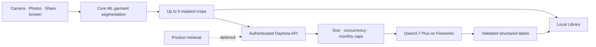

<p align="center">
  
</p>

<h1 align="center">Stylezam</h1>

<p align="center">
  <strong>Capture a look. Separate the pieces. Keep what matters.</strong><br>
  A native iPhone fashion-capture foundation with on-device garment segmentation and bounded cloud labeling.
</p>

<p align="center">
  
  
  
  
</p>

Stylezam’s first release boundary is intentionally honest: photo capture, live garment detection, crop creation, structured labeling, and the local Library are implemented. Shopping retrieval, current prices, and virtual try-on are disabled until a separate retrieval benchmark is complete. Disabled routes fail with `feature_not_enabled`; the app does not show sample products or simulated matches.

## What works now

- A custom full-screen camera with rear/front switching, flash, photo mode, and hybrid Live mode.
- Automatic Live capture when a frame is stable, plus a manual shutter at any time.
- Up to five pieces per look by default; Developer Debug can raise the limit to 12.
- A Wi-Fi-only, checksum-verified 59 MB Core ML model download.
- On-device RF-DETR garment detection, masks, crops, and labels for Fashionpedia’s 27 item classes.
- One bounded Qwen3.7 Plus request through Fireworks to validate and enrich all crops from a look.
- A non-destructive Vision Inspector in Settings → Developer Debug that overlays every box, shows transparent crops on light and dark backgrounds, reports confidence and timing, and can manually exercise the real crop-label endpoint.
- A local Library containing the original look, individual pieces, source, timestamp, and analysis state.
- Duplicate suppression for recent Live and screen captures.
- Photo import, clipboard input, App Intents, a Control Center control, Live Activities, and Dynamic Island state.
- Share-extension source and handoff UI, with cross-process image handoff requiring an App Group entitlement that a free Personal Team may not provision.
- An iOS 27 ScreenCaptureKit adapter behind SDK availability checks; the iOS 26 build shows a truthful unavailable state.

<table>
  <tr>
    <td width="33%" align="center"></td>
    <td width="33%" align="center"></td>
    <td width="33%" align="center"></td>
  </tr>
</table>

## Current architecture



The Daytona service has no server-side inference model, PyTorch, GPU runtime, or local inference server. Detection runs on the iPhone. The 2-core/4 GB service only authenticates requests, distributes the hashed Core ML pack, normalizes temporary crops, enforces a 24 MB request cap and two-analysis concurrency cap, and calls Fireworks.

Read the full [architecture](./docs/ARCHITECTURE.md), [provider decision](./docs/PROVIDERS.md), [privacy behavior](./docs/PRIVACY.md), and [vision benchmark](./docs/VISION_BENCHMARK.md).

## Model decision

The selected pack is `resoa/garment-detector-seg`, an RF-DETR-Seg-Small checkpoint converted to FP16 Core ML. The model card and RF-DETR’s designated small segmentation model are Apache-2.0; Fashionpedia’s annotations and ontology are CC BY 4.0. The exact source revision, source-checkpoint SHA-256, and every shipped Core ML file hash are embedded in the model manifest.

The release item taxonomy includes clothing, shoes, bags/wallets, hats/head coverings, glasses, ties, gloves, watches, belts, socks/stockings, scarves, and umbrellas. Rings, bracelets, necklaces, and earrings are not reliable V1 detections because Fashionpedia does not provide those as item classes. Qwen3.7 Plus can label jewelry only after a real crop exists, so Stylezam does not pretend the missing detector coverage is solved.

## Run the checks

```bash
./scripts/bootstrap_backend.sh
./scripts/check.sh
```

The check script runs the backend tests, validates the published model pack, regenerates the Xcode project, and builds all iOS targets for the simulator with signing disabled.

## Deploy the CPU service

The production container is pinned to a Python base-image digest and installs only hash-locked Python packages. The Daytona helper deliberately requests exactly 2 CPU cores, 4096 MB RAM, 10 GB disk, no auto-stop, and no GPU:

The versioned public image for the Daytona dashboard is:

```text
ghcr.io/meowshmalloww/stylezam-backend:0.1.0
```

Select **Image**, allocate 2 CPU / 4 GB RAM / 10 GB disk with no GPU, disable auto-stop, enable Public HTTP Preview, and leave outbound networking enabled. Add the Fireworks credential and a separate random Stylezam service password through Daytona Environment Variables; neither secret is part of the image.

```bash
export STYLEZAM_API_TOKEN="a-long-random-service-token"
export STYLEZAM_FIREWORKS_API_KEY="your-fireworks-key"
export STYLEZAM_FIREWORKS_MONTHLY_CAP=100
./scripts/create_daytona.sh
```

The script requires an authenticated Daytona CLI and does not install it for you. After creation, copy the sandbox’s public port 8000 HTTPS preview URL and the same service token into Settings → Developer Debug. The iPhone client rejects localhost and insecure HTTP addresses.

Fireworks Qwen3.7 Plus is a serverless pay-per-token API. Stylezam’s monthly count is a hard application-side call stop, but it is not an account billing guarantee. Fireworks also documents a prepaid-credit model and an account monthly spend limit that pauses API requests when reached. Set the account limit to $50 before adding the replacement key; see [Setup](./docs/SETUP.md). The Fireworks limit applies to the whole account, while Stylezam’s lower call cap protects this service specifically.

See [Setup](./docs/SETUP.md) for signing, physical-device installation, Daytona, and iOS 27 steps.

## Repository map

```text
App/                    SwiftUI app, custom camera, Library, and Core ML runtime
Extensions/Share/       image/text Share extension
Extensions/Widgets/     Control Widget, Live Activity, and Dynamic Island UI
Shared/                 App Group, App Intents, and activity attributes
backend/                CPU-only FastAPI service and locked runtime dependencies
backend/.data/model-packs/
                        immutable Core ML pack published to authenticated phones
Config/                 Fashionpedia class ordering and build configuration
docs/                   architecture, setup, privacy, benchmark, and design notes
scripts/                build, benchmark, package, deployment, and verification tools
```

## Known release blockers

- The real iOS 27 screen path still needs Xcode 27 and an iOS 27 device test. This Mac currently has Xcode 26.6 and the iOS 26.5 SDK.
- Daytona deployment still needs your Daytona authentication, Fireworks key, and chosen service token.
- The real Qwen3.7 Plus request cannot be integration-tested without spending one provider call; the request/response contract is covered by a mocked test.
- Physical-device App Group, Share extension, Control Widget, Live Activity, and camera behavior require signing and device verification.
- Product retrieval, prices, and try-on remain off by design.

## License and notices

Stylezam source is licensed under [Apache License 2.0](./LICENSE). Model, dataset, and runtime notices are in [THIRD_PARTY_NOTICES.md](./THIRD_PARTY_NOTICES.md). License selection is engineering due diligence, not legal advice.
