<p align="center">
  
</p>

<h1 align="center">Stylezam</h1>

<p align="center">
  <strong>Capture a look. Find the pieces. Try them on.</strong><br>
  A native iPhone fashion scanner with on-device vision, live product discovery, AI assistance, and photo try-on.
</p>

<p align="center">
  
  
  
  
</p>

Stylezam detects fashion pieces locally from the camera, Photos, clipboard, Share sheet, and an authorized iOS 27 Live Screen session. It saves high-resolution crops to a private Library and waits for the user before starting any metered search, AI, or try-on request.

<table>
  <tr>
    <td width="33%" align="center"></td>
    <td width="33%" align="center"></td>
    <td width="33%" align="center"></td>
  </tr>
</table>

Motion previews: [launch sequence](./Artifacts/VisualQA/stylezam-launch-sequence.mp4) · [app tour](./Artifacts/VisualQA/stylezam-motion-tour.mp4)

## What is included

| Area | Implementation |
|---|---|
| Capture | Photo and Live camera modes, front/rear cameras, pinch and optical zoom controls, flash, Photos, clipboard, Share extension, and App Intents. |
| Local vision | Bundled FP16 RF-DETR Core ML segmentation model, Fashionpedia labels, Apple Vision verification for uncertain objects, temporal confirmation, high-resolution crops, masks in Developer Inspector, and durable duplicate suppression. |
| Live Screen | User-authorized iOS 27 ScreenCaptureKit capture, safe-area filtering, two-observation confirmation, local crops, Live Activity feedback, and compact Dynamic Island status. |
| Product discovery | One explicit request per search. Eligible visual and keyword providers rotate rather than repeatedly consuming one account. Results retain real provider prices, links, evidence, and seller offers. |
| Stylezam AI | Persistent Fireworks vision chat with on-device voice dictation. Local metadata embeddings retrieve at most a few relevant owned pieces before the selected crop and up to two matching crops enter a request. Similar and cheaper actions create grounded text queries and make one keyword-shopping request. |
| Try On | Reusable person photos, automatic Outfit / Hand and Wrist / Face and Neck context, manual override, an opt-in rail, sequential multi-item composition, and YouCam category tasks. |
| Media finishing | Optional YouCam enhancement, lighting, background removal, background replacement, and 480p / 720p / 1080p five-second video generation. |
| Cloud Library | Optional Supabase private-bucket sync for garment/wardrobe crops plus Search, Finds, and chat metadata. Full captures, person photos, try-on references, and generated try-on portraits remain device-only. |
| Accounts | Firebase Google Sign-In, StoreKit 2 monthly/annual Plus and Pro products, restore support, signed Developer claims, and per-plan private-cloud allowances. |

Supported try-on categories are clothes, bags, scarves, shoes, hats, rings, bracelets, earrings, watches, and necklaces. A scan adds a piece to the reusable wardrobe but does not turn it on automatically. Opening **Try On** activates only the piece the user chose; additional pieces must be selected deliberately.

Single-accessory results are checked before they are saved. Strong bedding or furniture evidence blocks a reference before upload, and large full-scene changes are rejected after generation. This protects the source person and scene when a provider interprets a pillow as a bag or invents an unrelated outfit. Clothes use YouCam Clothes V4 with shoe replacement disabled unless shoes are the selected category.

## Architecture

```mermaid
flowchart LR
    Inputs["Camera · Photos · Share · Live Screen"] --> Local["On-device RF-DETR + Apple verification"]
    Local --> Crops["High-resolution crops · masks · deduplication"]
    Crops --> Library["Private local Library"]
    Library --> Retrieve["On-device metadata embeddings"]
    Library -. "opt-in garment crops + metadata" .-> Cloud["Supabase private Storage + Postgres RLS"]
    Crops --> Choice["User selects a piece"]
    Choice --> Visual["One rotating visual-search provider"]
    Retrieve --> Chat["Bounded relevant Library context"]
    Choice --> Chat
    Chat --> Terms["Grounded shopping terms"]
    Terms --> Keyword["One rotating keyword provider"]
    Visual --> Results["Normalized products · prices · sellers"]
    Keyword --> Results
    Choice --> Rail["Opt-in Try On rail"]
    Rail --> Consent["Person photo · context · upload consent"]
    Consent --> YouCam["Sequential category tasks"]
    YouCam --> Finish["Optional enhance · light · background · video"]
    Finish --> Library
```



The detector always receives its fixed 384 × 384 tensor, as required by the model. Stylezam does not reduce a 4K photo to a single 384 px result: still images use one global pass plus bounded overlapping detail tiles, merge detections in source coordinates, and crop from an orientation-corrected source up to 5120 px. Live modes use smaller sampled frames, discard late work, require stable evidence, and pause automatic inference under serious thermal pressure.

### Search routing

- **Private image bytes:** Lykdat and Google Cloud Vision Web Detection.
- **Public HTTPS image URL required:** SearchAPI.io Lens, SerpApi Lens, and Bright Data Lens. Stylezam does not silently publish a private crop to make these providers eligible.
- **Text shopping query:** Serper, SearchAPI.io, SerpApi, or Bright Data. These routes do not require a public image URL.

Only one provider is called for one search. Eligible providers rotate after a completed attempt and wrap back to the first provider. Failed attempts remain retryable; successful garment searches are cached by default to protect monthly allowances. Developer Debug exposes readiness, request history, limits, and the next route without exposing credentials.

Match percentages appear only when a provider supplies a score or when Stylezam can reproduce an exact query-to-title overlap score. Rank-only visual results remain qualitative; the app does not invent similarity precision, prices, or products.

## Quick start

Requirements:

- Xcode 27 for the Live Screen target; the main app deploys to iOS 18 and later.
- An Apple Development Team for a physical-device build.
- The tracked Core ML package in `App/Resources/Models/`.

```bash
./scripts/check.sh
./scripts/generate_project.sh
open Stylezam.xcodeproj
```

Local capture, detection, crops, masks, duplicate memory, and Library storage work without any provider key or local server.

For signed-in or network features:

```bash
cp .env.example .env
chmod 600 .env
# Add only the providers you intend to test.
./scripts/install_on_device.sh
```

`.env` is ignored by Git. The debug installer imports configured values into the iPhone Keychain; the app does not show secret values in Settings. Configure these names as needed:

```dotenv
STYLEZAM_FIREWORKS_API_KEY=
STYLEZAM_SERPER_API_KEY=
STYLEZAM_LYKDAT_API_KEY=
STYLEZAM_GOOGLE_VISION_API_KEY=
STYLEZAM_SEARCHAPI_API_KEY=
STYLEZAM_SERPAPI_API_KEY=
STYLEZAM_BRIGHTDATA_API_KEY=
STYLEZAM_BRIGHTDATA_ZONE=
STYLEZAM_YOUCAM_API_KEY=
```

Firebase Google Sign-In and optional Supabase Cloud Library use the private local configuration described in [Setup](./docs/SETUP.md). Supabase needs the Project URL and publishable key only; never put its secret/service-role key in the app. Do not distribute a working-directory archive containing `.env`, local cloud configuration, signing files, or derived build products.

## Live Screen on iOS 27

Build with the iOS 27 SDK, add the **Stylezam Live Screen** control to Control Center, open it, and approve Apple's system sharing picker. Apple requires this user action; an app cannot silently capture another app. Once authorized, Stylezam analyzes complete background frames locally, ignores system safe-area chrome, saves a confirmed garment crop, and never starts a paid search automatically. Camera, Photos, clipboard, Share, and Screenshot Shortcut remain available on iOS 18 through 26.

## Verification

```bash
./scripts/check.sh

# Full unit, integration, and Control Center UI tests
xcodebuild -project Stylezam.xcodeproj \
  -scheme Stylezam \
  -destination 'platform=iOS Simulator,name=iPhone 17 Pro' \
  test
```

The repository check verifies the model manifest and hashes, regenerates the Xcode project, builds every target, and confirms the compiled app contains the model. The test suite also verifies detection correction, duplicate handling, cloud privacy projection, bounded Library retrieval, try-on state, performance safeguards, and the system sharing picker.

## Repository map

```text
App/                    SwiftUI app, camera, vision, search, chat, Library, and try-on
App/Resources/Models/   bundled Core ML model and verified manifest
Extensions/Share/       image and text Share extension
Extensions/Widgets/     Control Center controls, Live Activity, and Dynamic Island
Shared/                 App Group, App Intents, and activity attributes
Config/                 model taxonomy and build configuration
docs/                   setup, architecture, privacy, benchmark, and validation notes
scripts/                project generation, device installation, and verification
```

## Privacy and release boundary

Detection, full captures, face/person photos, and try-on media are local. Optional cloud sync stores only private garment crops and structured Library metadata behind Firebase identity plus Supabase RLS. AI audio is transient and on-device; only the editable transcript is sent after the user submits it. A chat turn performs local/pgvector retrieval first and sends one selected crop plus no more than two relevant owned crops. Network requests otherwise occur only after an explicit product-search, AI, cloud-sync, or upload-consented try-on action. Provider credentials in a debug build live in Keychain, but a public App Store release must use a scoped server-side credential broker; shipping reusable service keys inside an app is not secure.

Google Web Detection returns matching pages and images, not guaranteed store inventory. Prices are current provider observations rather than tracked price history. YouCam output is generative and is not proof of physical fit. Read [Privacy](./docs/PRIVACY.md), [Architecture](./docs/ARCHITECTURE.md), and [Model decision](./docs/MODEL_DECISION.md) before distribution.

Stylezam source is licensed under the [Apache License 2.0](./LICENSE). Model, dataset, and platform licenses are recorded in [Third-Party Notices](./THIRD_PARTY_NOTICES.md).
