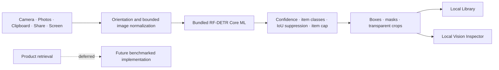

<p align="center">
  
</p>

<h1 align="center">Stylezam</h1>

<p align="center">
  <strong>Capture a look. Separate the pieces. Keep what matters.</strong><br>
  A native iPhone fashion-capture app with fully on-device garment detection and segmentation.
</p>

<p align="center">
  
  
  
  
</p>

Stylezam’s current build is local by design. The RF-DETR Core ML model is included in the application, compiled by Xcode, and loaded directly on the iPhone. Capture, boxes, masks, transparent crops, duplicate filtering, and Library storage do not require a cloud host, local computer, API token, provider key, or first-run model download.

Product retrieval, current prices, and virtual try-on remain deferred. The app does not insert sample products, simulated progress, or invented prices while those features are unavailable.

## What works now

- Custom full-screen camera with rear/front switching, flash, Photo mode, and hybrid Live mode.
- Automatic Live capture after a stable, high-quality frame, plus a manual shutter at any time.
- Bundled 61.7 MB FP16 Core ML garment-segmentation package—no setup download.
- On-device boxes, instance masks, Fashionpedia item classes, and transparent PNG crops.
- Up to five pieces per look by default; Developer Debug can raise the limit to 12.
- Real Vision Inspector with source overlays, crop previews, normalized geometry, confidence, byte counts, and measured local inference time.
- Local Library containing the source look, detected pieces, capture source, and timestamp.
- Duplicate suppression for recent Live and screen captures.
- Photo import, clipboard input, Share extension, App Intents, Control Center control, Live Activities, and Dynamic Island state.
- Conditional iOS 27 ScreenCaptureKit adapter; iOS 26 continues to support camera, import, clipboard, and Share input.

<table>
  <tr>
    <td width="33%" align="center"></td>
    <td width="33%" align="center"></td>
    <td width="33%" align="center"></td>
  </tr>
</table>

## Architecture



Live preview avoids crop creation and mask materialization; those heavier operations run only for an accepted photo. Core ML is cached after first load and uses all compute units available to the device. See [Architecture](./docs/ARCHITECTURE.md), [Model decision](./docs/MODEL_DECISION.md), [Privacy](./docs/PRIVACY.md), and [Vision benchmark](./docs/VISION_BENCHMARK.md).

## Bundled model

The selected artifact is `resoa/garment-detector-seg`, an RF-DETR-Seg-Small checkpoint converted to FP16 Core ML at 384 × 384. The exact source revision, checkpoint SHA-256, compiled-input/output contract, class order, license declarations, and each package-file hash are recorded in `App/Resources/Models/garment-segmentation.json`.

The item taxonomy covers core clothing, shoes, bags/wallets, hats/head coverings, glasses, ties, gloves, watches, belts, socks/stockings, scarves, and umbrellas. Fashionpedia does not provide reliable item classes for rings, bracelets, necklaces, or earrings, so this build does not pretend those classes are solved.

## Build and verify

```bash
./scripts/check.sh
```

The check verifies every bundled model file against its published byte count and SHA-256, regenerates the Xcode project, builds all iOS targets for the simulator, and proves the resulting `Stylezam.app` contains both the compiled `.mlmodelc` and its manifest.

For development and a connected iPhone:

```bash
./scripts/generate_project.sh
open Stylezam.xcodeproj
```

Choose your Development Team and run the `Stylezam` scheme. A free Personal Team can install the main app for seven-day testing, subject to Apple’s capability and provisioning limits. See [Setup](./docs/SETUP.md).

## Repository map

```text
App/Resources/Models/  bundled Core ML package and verified manifest
App/                    SwiftUI app, camera, local vision runtime, and Library
Extensions/Share/       image/text Share extension
Extensions/Widgets/     Control Widget, Live Activity, and Dynamic Island UI
Shared/                 App Group, App Intents, and activity attributes
Config/                 Fashionpedia class ordering and build configuration
docs/                   architecture, setup, privacy, benchmark, and design notes
scripts/                project generation, model research/export, and verification
```

## Known release boundaries

- Product retrieval, current prices, and virtual try-on are not implemented in this local vision build.
- The conditional iOS 27 screen path still requires an iOS 27 SDK/device verification pass.
- Physical-device camera performance, thermals, Live Activity, extensions, and App Group provisioning must be tested with the final signing team.
- App Store privacy disclosures and model/dataset legal review remain release tasks.

Stylezam source is licensed under [Apache License 2.0](./LICENSE). Model, dataset, and platform notices are in [THIRD_PARTY_NOTICES.md](./THIRD_PARTY_NOTICES.md).
