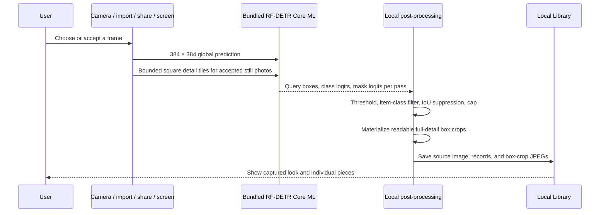

# Architecture

## Current boundary

Stylezam implements local fashion capture, garment instance detection, crop creation, inspection, persistence, explicitly triggered product retrieval, and optional photo-based virtual try-on backed by YouCam.

## Photo try-on

The Try On workspace accepts a person photo from Stylezam's front/rear camera or Photos and a selectable rail of product or Library-piece images. Selected items are applied sequentially through YouCam's category-specific asynchronous APIs, so each completed result becomes the source for the next item. Finished images can be saved locally in Library. Clothing uses the clothes v3 endpoint with automatic garment-category detection; bags, scarves, shoes, and hats use their dedicated endpoints; jewelry uses the dedicated 2D VTO endpoints. Outfit, Hand/Wrist, and Face/Neck are separate photo contexts because one full-body photo cannot reliably satisfy every endpoint. The workspace verifies the credential through YouCam's feature-cost endpoint, exposes the actual upload/task/polling phase, and translates provider errors into retake or product-image guidance. After each result is downloaded, Stylezam requests deletion of that finished remote task and its associated media.

The prototype bearer credential is stored in the device Keychain or imported from an ignored `.env` file for a Debug launch. Production distribution requires a server-side credential proxy rather than embedding a shared bearer token in the app.

## Capture data flow

No camera frame or accepted photo is sent during detection. A selected garment crop leaves the device only after the user starts a product search or asks the image-aware assistant.

## Product search data flow

The default private developer route is:

1. persist a logical search reservation before networking;
2. send the selected crop directly to Lykdat Global Search or Google Cloud Vision Web Detection;
3. select the provider result group that best matches the chosen local garment label;
4. normalize, cap, display, and persist the real provider results.

Each detected piece in Library Recent exposes both routes directly. **Find products & prices** hands the existing scan and garment identifiers to Search and starts one provider request only when no saved search exists. **Try on crop** adds the already-saved local crop to the YouCam rail without performing a product search. Developer Debug can pin an eligible visual provider; if that provider needs configuration the current capture cannot satisfy, Search names and uses an eligible fallback.

Stylezam AI is separate: each garment has a bounded, locally persisted conversation. A turn sends the selected crop, recent conversation context, and new prompt to Fireworks Qwen 3.7 Plus. Qwen runs in non-thinking mode for predictable structured answers and returns both the response and relevant follow-up questions. Only when the user explicitly taps **Find similar** or **Find cheaper** does Stylezam ask Qwen for grounded shopping keywords and send one generated text query—not the photo—to Serper Shopping. Cheaper-result presentation orders comparable priced results from lower to higher and leaves products without a parsed price afterward.

The default is one successful product search per garment. Logical reservations and provider counts survive relaunches. Failed requests remain in the diagnostic ledger because providers may still count them, but they do not consume the user's successful-search allowance and can be retried.

Lykdat Global Search and Google Cloud Vision Web Detection accept binary image data. The Google adapter sends one image with exactly one `WEB_DETECTION` feature and reserves one unit in a separately persisted, non-increasable 1,000-unit monthly safety counter before networking. SearchAPI.io and SerpApi Google Lens accept public image URLs, so Stylezam refuses to publish a private crop automatically. The Bright Data adapter requires a user-created compatible SERP zone and token and remains unavailable until both exist.

## Inputs

The custom AVFoundation camera owns preview, rear/front switching, flash, manual shutter, and Live mode. Photos, clipboard images, App Intents, Share input, and an authorized iOS 27 screen frame converge on `AppModel.processCapture`.

The Share and cross-process control paths require the same App Group entitlement across signed targets. A Personal Team can test the main app but may not provision every extension capability.

## Bundled Core ML model

`App/Resources/Models/StylezamGarmentSegmentation.mlpackage` is part of the application resources. Xcode compiles it to `StylezamGarmentSegmentation.mlmodelc` while building the app. `ModelPackManager` resolves the compiled resource and loads the adjacent verified manifest; it has no downloader, network monitor, staging directory, or removable model state.

The model accepts a `1 × 3 × 384 × 384` normalized tensor and produces query boxes, class logits, and masks. Stylezam:

1. scores Fashionpedia item classes 0–26;
2. rejects confidence below 0.35 and very small boxes;
3. suppresses high-IoU duplicate boxes of the same class;
4. keeps the configured maximum, five by default and 12 at most;
5. creates a high-quality JPEG directly from the accepted source image for
   Library. Vision Inspector can separately materialize the raw transparent
   mask cutout for diagnosis.

The model object is cached by `GarmentVisionEngine` and configured with
`MLComputeUnits.cpuOnly`. Device verification found that this model export
returns all-zero class logits through the iOS GPU/Neural Engine path; CPU-only
execution returns the expected boxes and classes. Continuous camera preview
stays single-pass and skips mask-array materialization and crop
creation. Live preview uses a stricter 0.55 confidence threshold, rejects
near-identical competing boxes, and requires the same region and label to agree
across consecutive sampled frames. Once Live consensus is reached, AVFoundation
takes a full-quality still rather than saving the compact preview JPEG. Accepted
Photo and Live images add overlapping square detail passes when the source
resolution, power mode, thermal state, and remaining 9-second budget allow it.
Tile detections are projected into source coordinates, edge-clipped tile
results are rejected, and cross-scale duplicates are suppressed before the
configured item cap is applied.

## Live capture

Live mode samples preview frames rather than processing every camera frame. Candidate confidence, garment area, clipping, luminance, and sharpness contribute to capture guidance. A low-resolution content gate backs an unchanged empty scene off to one inference every 2.4 seconds after two empty results; motion or any candidate immediately returns to the normal fast cadence. A lightweight temporal tracker smooths boxes and only displays a category after two agreeing observations on the same region. Automatic capture requires three stable tracked signatures, a ready frame, and a cooldown. The shutter remains available at all times.

Recent Live and screen box crops use a perceptual dHash guard to suppress obvious repeats. These are deterministic capture heuristics, not biometric or identity recognition and not calibrated accuracy guarantees.

## Local persistence

The Library stores source images, readable garment box-crop JPEGs,
class/confidence/box records, capture source, per-garment chat history, and time under the app container.
The current raw mask is diagnostic-only because its iOS regions are not reliable
enough for a product-facing cutout. A bounded snapshot keeps the most recent
media. Deleting a scan removes its source and crop files; clearing Library
removes all local media and saved legacy records.

Live screen preview frames remain in a short in-memory rolling buffer. Stopping capture clears that buffer.

## Item coverage

The emitted item classes cover shirts/blouses, tops, sweaters, cardigans, jackets, vests, pants, shorts, skirts, coats, dresses, jumpsuits, capes, glasses, hats/head coverings, ties, gloves, watches, belts, leg warmers, tights/stockings, socks, shoes, bags/wallets, scarves, and umbrellas.

Part/detail classes such as sleeves, collars, pockets, zippers, and sequins are not emitted as separate Library pieces. Rings, bracelets, necklaces, and earrings require a future benchmarked accessory detector or explicit crop workflow.

## iOS 27 screen path

ScreenCaptureKit code is compiled only when the installed SDK exposes it. Apple’s system content-sharing picker supplies authorization; Stylezam cannot silently begin a display stream or return to the previous app. Complete frames are orientation-corrected, encoded directly from their Core Image buffers, thermally throttled, and buffered in memory. A 480 px, four-region difference hash rejects moving frames before Core ML runs; it samples the central content area and excludes narrow system-status and toolbar bands. After two visually stable samples, one crop-free global-plus-detail discovery prevents tall pages from hiding small or edge-positioned garments; later confirmation frames use one square focus region around the discovered item. Three agreeing garment observations are required before the accepted device-resolution frame enters the normal crop, duplicate, Library, Live Activity, and notification pipeline. Captured and twice-verified empty screens are sampled only every four seconds at nominal thermal state until their content hash changes. Low Power Mode and elevated thermal pressure lengthen the cadence, while serious/critical pressure pauses automatic work. iOS owns the system privacy indicator, and Stylezam does not draw an imitation recording border over other apps.

## Failure behavior

- Missing or invalid bundled model: capture stops with a clear reinstall/build error; it does not silently switch to fabricated labels.
- No garment above threshold: the source can still be saved with zero pieces.
- Duplicate Live/screen item: no duplicate scan is added.
- Missing provider key/zone: no request is reserved or dispatched; Search names the missing configuration.
- Per-piece or monthly local limit reached: the request stops before networking.
- Dispatched provider failure: the attempt remains visible in Search Diagnostics and is not silently retried.
- iOS 18–26: screen capture reports unavailable; camera, Photos, clipboard, and Share paths continue.
