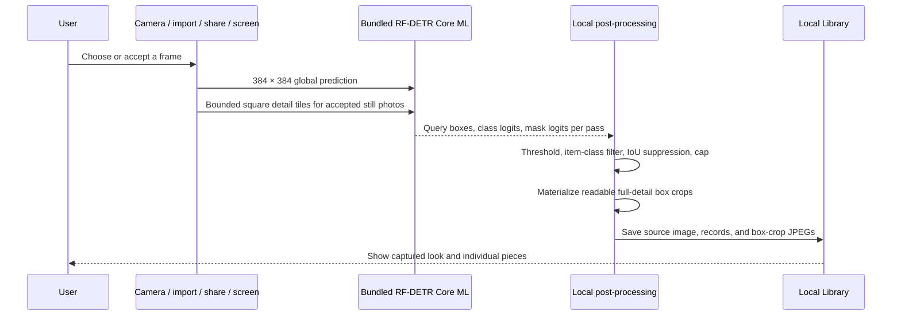

# Architecture

## Current boundary

Stylezam implements local fashion capture, garment instance detection, crop creation, inspection, persistent wardrobe and try-on state, explicitly triggered product retrieval, and optional photo-based virtual try-on backed by YouCam.

## Photo try-on

After an accepted scan is persisted, each accepted garment crop is added to the local wardrobe and persistent Try On rail with selection on. A lower-body item keeps two durable local media roles: the tight crop shown in wardrobe/rail UI and a separate full originating frame retained as a best-effort candidate for YouCam's worn-garment reference. Detection identifies the garment region but cannot validate locally that a photo or web frame visibly shows the garment worn by one clear person. The rail therefore exposes ready/missing state, blocks Create when a selected lower-body reference is missing, and lets the user add or replace the worn photo. Identical reference bytes use one content-addressed file shared by wardrobe metadata records. This capture-side promotion performs no product search, thumbnail load, or YouCam call. If the user later starts a product search and it succeeds, Stylezam best-effort matches the source scan and garment identifiers and updates that same rail record with the merchant product and purchase link. Both detected media roles are preserved, so exact-source enrichment does not depend on downloading a merchant thumbnail. Search success is independent from this optional enrichment.

The Try On workspace keeps a reusable person-photo history from Stylezam's front/rear camera or Photos. The stage pages through prior photos and an add-photo page. Its expandable rail has **Pieces** and **Shop** views: users can select or deselect several pieces, remove rail entries without deleting the underlying wardrobe item, add items from the wardrobe, and open available merchant links. Outfit, Hand/Wrist, and Face/Neck remain separate photo contexts because one full-body photo cannot reliably satisfy every endpoint. Selected pieces that do not match the active photo context stay parked on the rail instead of being submitted to a likely failing paid task.

After the user explicitly enables upload consent, one Create action sorts the compatible selected rail items into a stable render order and passes them to `YouCamTryOnService.render`. The action discloses the exact number of YouCam try-on tasks it will start. The service does not claim or emulate a one-call multi-garment request: it runs one category-specific asynchronous task per item and uses each downloaded result as the source photo for the next task. Clothing uses the clothes v3 endpoint with an explicit upper-body, lower-body, or full-body category when Stylezam can infer one and falls back to automatic detection otherwise; bags, scarves, shoes, and hats use their dedicated endpoints; jewelry uses the dedicated 2D VTO endpoints. After each result is downloaded, Stylezam requests deletion of that finished remote task and associated media, including when the local operation has been cancelled.

**View as video** uploads the completed still to YouCam image-to-video v2 and requests the provider-supported 5-second output at 480p. The current YouCam price for that configuration is 5 units and is presented as provider pricing that can change. The app plays three seconds, pauses, and returns to the still; the downloaded video is temporary rather than a saved Library artifact. Saving a still creates a Past Try-On record containing the rendered image, person-photo/context metadata, and a snapshot of every rail item at that moment. The snapshot records the pieces actually applied to that photo plus the toggled-off or context-incompatible rail items, and retains embedded merchant details and purchase URLs even if the live rail later changes.

The workspace verifies basic credential connectivity through YouCam's feature-cost endpoint, exposes the actual upload/task/polling phase, and translates provider errors into retake or product-image guidance. That check does not prove that the account is entitled to every category or image-to-video operation. Clothes v3 also requires a lower-body reference to visibly show the garment being worn by one clear person rather than as a standalone product image. A detected item's separately persisted full source frame is only a candidate for that request and cannot be validated locally; the user-facing rail warns about the rule, allows replacement, and keeps the display crop separate. Identical reference frames remain content-deduplicated. A complete real entitled-key, physical-device smoke test remains outstanding.

The prototype bearer credential is stored in the device Keychain or imported from an ignored `.env` file for a Debug launch. Production distribution requires a server-side credential proxy rather than embedding a shared bearer token in the app.

## Capture data flow

No camera frame or accepted photo is sent during detection. A selected garment crop leaves the device only after the user starts a product search or asks the image-aware assistant.

## Product search data flow

The default private developer route is:

1. persist a logical search reservation before networking;
2. send the selected crop directly to Lykdat Global Search or Google Cloud Vision Web Detection;
3. select the provider result group that best matches the chosen local garment label;
4. normalize, cap, display, and persist the real provider results.

Every accepted detected piece already enters the persistent Try On rail locally, selected by default. Each piece in Library Recent also exposes both explicit routes directly. **Find products & prices** hands the existing scan and garment identifiers to Search and starts one provider request only when no saved search exists. A successful search best-effort enriches the exact source rail item with the first shoppable result; enrichment failure remains nonfatal and does not consume another search. **Try on crop** can re-add the already-saved local crop without performing a product search. Developer Debug can pin an eligible visual provider; if that provider needs configuration the current capture cannot satisfy, Search names and uses an eligible fallback.

Stylezam AI is separate: each garment has a bounded, locally persisted conversation. A turn sends the selected crop, recent conversation context, and new prompt to Fireworks Qwen 3.7 Plus. Qwen runs in non-thinking mode for predictable structured answers and returns both the response and relevant follow-up questions. Only when the user explicitly taps **Find similar** or **Find cheaper** does Stylezam ask Qwen for grounded shopping keywords and send one generated text query—not the photo—to Serper Shopping. Cheaper-result presentation orders comparable priced results from lower to higher and leaves products without a parsed price afterward.

The default is one successful product search per garment. Logical reservations and provider counts survive relaunches. Failed requests remain in the diagnostic ledger because providers may still count them, but they do not consume the user's successful-search allowance and can be retried.

Lykdat Global Search and Google Cloud Vision Web Detection accept binary image data. The Google adapter sends one image with exactly one `WEB_DETECTION` feature and reserves one unit in a separately persisted, non-increasable 1,000-unit monthly safety counter before networking. SearchAPI.io and SerpApi Google Lens accept public image URLs, so Stylezam refuses to publish a private crop automatically. The Bright Data adapter requires a user-created compatible SERP zone and token and remains unavailable until both exist.

## Inputs

The custom AVFoundation camera owns preview, rear/front switching, flash, manual shutter, and Live mode. Photos, clipboard images, App Intents, Share input, and an authorized iOS 27 screen frame converge on `AppModel.processCapture`.

The Share and cross-process control paths require the same App Group entitlement across signed targets. A Personal Team can test the main app but may not provision every extension capability.

## Bundled Core ML model

`App/Resources/Models/StylezamGarmentSegmentation.mlpackage` is part of the application resources. Xcode compiles it to `StylezamGarmentSegmentation.mlmodelc` while building the app. `ModelPackManager` resolves the compiled resource and loads the adjacent verified manifest; it has no downloader, network monitor, staging directory, or removable model state.

The model accepts a `1 × 3 × 384 × 384` normalized tensor and produces query boxes, class logits, and masks. Stylezam:

1. scores Fashionpedia item classes 0–26;
2. rejects confidence below 0.35 and very small boxes;
3. suppresses high-IoU duplicate boxes of the same class;
4. keeps the configured maximum, five by default and 12 at most;
5. creates a high-quality JPEG directly from the accepted source image for
   Library. Vision Inspector can separately materialize the raw transparent
   mask cutout for diagnosis.

The model object is cached by `GarmentVisionEngine` and configured with
`MLComputeUnits.cpuOnly`. Device verification found that this model export
returns all-zero class logits through the iOS GPU/Neural Engine path; CPU-only
execution returns the expected boxes and classes. Continuous camera preview
stays single-pass and skips mask-array materialization and crop
creation. Live preview uses a stricter 0.55 confidence threshold, rejects
near-identical competing boxes, and requires the same region and label to agree
across consecutive sampled frames. Once Live consensus is reached, AVFoundation
takes a full-quality still rather than saving the compact preview JPEG. Accepted
Photo and Live images add overlapping square detail passes when the source
resolution, power mode, thermal state, and remaining 9-second budget allow it.
Tile detections are projected into source coordinates, edge-clipped tile
results are rejected, and cross-scale duplicates are suppressed before the
configured item cap is applied.

## Live capture

Live mode samples preview frames rather than processing every camera frame. Candidate confidence, garment area, clipping, luminance, and sharpness contribute to capture guidance. A low-resolution content gate backs an unchanged empty scene off to one inference every 2.4 seconds after two empty results; motion or any candidate immediately returns to the normal fast cadence. A lightweight temporal tracker smooths boxes and only displays a category after two agreeing observations on the same region. Automatic capture requires three stable tracked signatures, a ready frame, and a cooldown. The shutter remains available at all times.

Recent Live and screen box crops use a perceptual dHash guard to suppress obvious repeats. These are deterministic capture heuristics, not biometric or identity recognition and not calibrated accuracy guarantees.

Live Screen samples at a 0.85-second nominal active cadence. Newly sampled
content receives one immediate full-screen tensor instead of waiting for the
entire page or video frame to become motionless. If that quick pass is empty and
the next low-resolution content signature agrees, the engine performs one
detail-aware discovery pass; a found region is confirmed with one focused
tensor. Two agreeing label/box/appearance observations promote the original
device-resolution frame to the accepted still pipeline. The continuous Live
Activity changes symbol and text for scanning, recognition, crop generation,
and save completion. Developer Debug retains only the latest authorized analyzed
frame in memory while the stream runs and renders the model's actual boxes and
crops inside Stylezam; the app never attempts to draw an overlay over another app.

## Local persistence

The Library stores source images, readable garment box-crop JPEGs,
durable full-frame try-on reference candidates for detected lower-body pieces, class/confidence/box records, capture source, per-garment chat history, persistent wardrobe items, current rail membership and selection, reusable person photos, and Past Try-On images and manifests under the app container. Reference blobs are content-addressed, so identical full frames are written once and deleted only after the last wardrobe record stops referring to them. A try-on manifest snapshots the items actually applied plus the parked and toggled-off rail items, records separate display/reference media digests, and embeds available product metadata and purchase links so later rail edits do not rewrite the saved look.
The current raw mask is diagnostic-only because its iOS regions are not reliable
enough for a product-facing cutout. A bounded snapshot keeps the most recent
media. Deleting a scan removes its source and crop files; clearing Library
removes all local media and saved legacy records.

Live screen preview frames remain in a short in-memory rolling buffer, and the
latest authorized analyzed frame remains available to Live Screen Inspector
while that stream runs. Stopping capture clears both in-memory surfaces.

## Item coverage

The emitted item classes cover shirts/blouses, tops, sweaters, cardigans, jackets, vests, pants, shorts, skirts, coats, dresses, jumpsuits, capes, glasses, hats/head coverings, ties, gloves, watches, belts, leg warmers, tights/stockings, socks, shoes, bags/wallets, scarves, and umbrellas.

Part/detail classes such as sleeves, collars, pockets, zippers, and sequins are not emitted as separate Library pieces. Rings, bracelets, necklaces, and earrings require a future benchmarked accessory detector or explicit crop workflow.

## iOS 27 screen path

ScreenCaptureKit code is compiled only when the installed SDK exposes it. Apple’s system content-sharing picker supplies authorization; Stylezam cannot silently begin a display stream or return to the previous app. Complete frames are orientation-corrected, encoded directly from their Core Image buffers, thermally throttled, and buffered in memory. A 480 px, four-region difference hash rejects moving frames before Core ML runs; it samples the central content area and excludes narrow system-status and toolbar bands. After two visually stable samples, one crop-free global-plus-detail discovery prevents tall pages from hiding small or edge-positioned garments; later confirmation frames use one square focus region around the discovered item. Three agreeing garment observations are required before the accepted device-resolution frame enters the normal crop, duplicate, Library, Live Activity, and notification pipeline. Captured and twice-verified empty screens are sampled only every four seconds at nominal thermal state until their content hash changes. Low Power Mode and elevated thermal pressure lengthen the cadence, while serious/critical pressure pauses automatic work. iOS owns the system privacy indicator, and Stylezam does not draw an imitation recording border over other apps.

## Failure behavior

- Missing or invalid bundled model: capture stops with a clear reinstall/build error; it does not silently switch to fabricated labels.
- No garment above threshold: the source can still be saved with zero pieces.
- Duplicate Live/screen item: no duplicate scan is added.
- Missing provider key/zone: no request is reserved or dispatched; Search names the missing configuration.
- Per-piece or monthly local limit reached: the request stops before networking.
- Dispatched provider failure: the attempt remains visible in Search Diagnostics and is not silently retried.
- Post-search rail enrichment failure: the real search remains saved and usable; the local crop stays on the rail.
- YouCam connection check succeeds but a category or video task is not entitled: the real provider error is shown; connectivity is not presented as an entitlement guarantee.
- iOS 18–26: screen capture reports unavailable; camera, Photos, clipboard, and Share paths continue.
