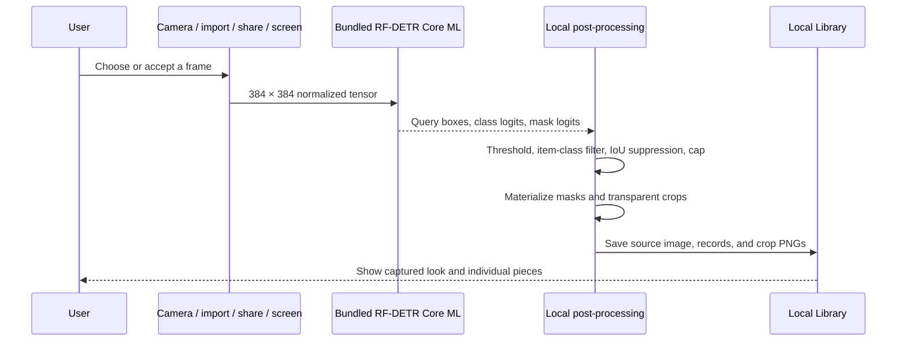

# Architecture

## Current boundary

Stylezam implements local fashion capture, garment instance detection, segmentation, crop creation, inspection, and persistence. Product retrieval and current prices remain deferred. Photo-based virtual try-on is an explicit network feature backed by YouCam.

## Photo try-on

The Try On workspace accepts a person photo and a selectable rail of product or Library-piece images. Selected items are applied sequentially through YouCam's category-specific asynchronous APIs, so each completed result becomes the source for the next item. Finished images can be saved locally in Library. Clothing uses the clothes v3 endpoint; bags, scarves, shoes, and hats use their dedicated endpoints; jewelry uses the dedicated 2D VTO endpoints. Outfit, Hand/Wrist, and Face/Neck are separate photo contexts because one full-body photo cannot reliably satisfy every endpoint. After each result is downloaded, Stylezam requests deletion of that finished remote task and its associated media.

The prototype bearer credential is stored in the device Keychain or supplied by an ignored local build configuration. Production distribution requires a server-side credential proxy rather than embedding a shared bearer token in the app.

## Capture data flow

No camera frame, accepted photo, garment crop, prompt, or model input is sent to a processing service.

## Inputs

The custom AVFoundation camera owns preview, rear/front switching, flash, manual shutter, and Live mode. Photos, clipboard images, App Intents, Share input, and an authorized iOS 27 screen frame converge on `AppModel.processCapture`.

The Share and cross-process control paths require the same App Group entitlement across signed targets. A Personal Team can test the main app but may not provision every extension capability.

## Bundled Core ML model

`App/Resources/Models/StylezamGarmentSegmentation.mlpackage` is part of the application resources. Xcode compiles it to `StylezamGarmentSegmentation.mlmodelc` while building the app. `ModelPackManager` resolves the compiled resource and loads the adjacent verified manifest; it has no downloader, network monitor, staging directory, or removable model state.

The model accepts a `1 × 3 × 384 × 384` normalized tensor and produces query boxes, class logits, and masks. Stylezam:

1. scores Fashionpedia item classes 0–26;
2. rejects confidence below 0.35 and very small boxes;
3. suppresses high-IoU duplicate boxes of the same class;
4. keeps the configured maximum, five by default and 12 at most;
5. creates a transparent PNG crop from the winning mask and source box.

The model object is cached by `GarmentVisionEngine` and configured with `MLComputeUnits.all`. Live preview skips mask-array materialization and crop creation; accepted captures perform that work once.

## Live capture

Live mode samples preview frames rather than processing every camera frame. Candidate confidence, garment area, clipping, luminance, and sharpness contribute to capture guidance. Automatic capture requires stable candidate signatures, a ready frame, and a cooldown. The shutter remains available at all times.

Recent Live and screen crops use a perceptual dHash guard to suppress obvious repeats. These are deterministic capture heuristics, not biometric or identity recognition and not calibrated accuracy guarantees.

## Local persistence

The Library stores source JPEGs, transparent garment PNGs, class/confidence/box records, capture source, and time under the app container. A bounded snapshot keeps the most recent media. Deleting a scan removes its source and crop files; clearing Library removes all local media and saved legacy records.

Live screen preview frames remain in a short in-memory rolling buffer. Stopping capture clears that buffer.

## Item coverage

The emitted item classes cover shirts/blouses, tops, sweaters, cardigans, jackets, vests, pants, shorts, skirts, coats, dresses, jumpsuits, capes, glasses, hats/head coverings, ties, gloves, watches, belts, leg warmers, tights/stockings, socks, shoes, bags/wallets, scarves, and umbrellas.

Part/detail classes such as sleeves, collars, pockets, zippers, and sequins are not emitted as separate Library pieces. Rings, bracelets, necklaces, and earrings require a future benchmarked accessory detector or explicit crop workflow.

## iOS 27 screen path

ScreenCaptureKit code is compiled only when the installed SDK exposes it. Apple’s system content-sharing picker supplies authorization; Stylezam cannot silently begin a display stream. Frames are throttled and buffered in memory. iOS owns the system privacy indicator, and Stylezam does not draw an imitation recording border over other apps.

## Failure behavior

- Missing or invalid bundled model: capture stops with a clear reinstall/build error; it does not silently switch to fabricated labels.
- No garment above threshold: the source can still be saved with zero pieces.
- Duplicate Live/screen item: no duplicate scan is added.
- Deferred text/product request: Search explains that product retrieval is not part of this build.
- iOS 26: screen capture reports unavailable; camera, Photos, clipboard, and Share paths continue.
