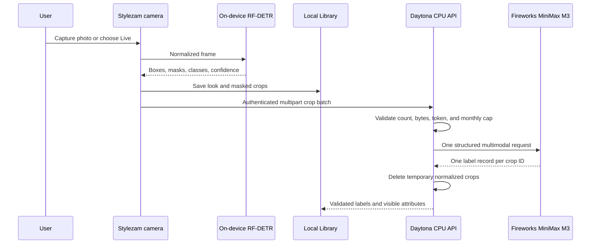

# Architecture

## Release boundary

This architecture implements garment capture and understanding. Product retrieval, today’s prices, and virtual try-on are feature-gated off. The existing route shapes are retained for later work, but disabled calls return an explicit service error and consume no provider quota.

## Data flow

## iPhone responsibilities

### Input

The custom AVFoundation camera owns the preview, rear/front switch, flash, manual shutter, and Live mode. Photos, clipboard images, App Intents, and an authorized iOS 27 screen frame enter the same `processCapture` path. The Share extension uses that path only when all signed targets receive the same App Group entitlement; a free Personal Team may not provision that capability.

### Live capture

Live mode samples preview frames instead of taking every frame. The on-device model reports candidates and a quality score using detection confidence, garment area, clipping, luminance, and sharpness. Automatic capture requires a stable candidate signature across consecutive frames, a ready-quality frame, and a cooldown. The user can always tap the shutter. Recent item crops are compared with a perceptual dHash guard to suppress obvious repeats.

These quality and duplicate checks are deterministic heuristics, not identity recognition and not a calibrated guarantee.

### Segmentation

The downloadable Core ML package accepts a normalized `1 × 3 × 384 × 384` tensor and returns query boxes, class logits, and masks. Stylezam:

1. scores only Fashionpedia item classes 0–26;
2. rejects confidence below 0.35 and very small boxes;
3. removes high-IoU same-class duplicates;
4. keeps the configured maximum, five by default and 12 at most;
5. turns the winning mask and box into a PNG crop.

If the pack is not installed, still-photo capture can use Apple’s foreground-instance mask as a limited fallback. Automatic Live detection requires the garment model.

### Model delivery

The app requests an authenticated manifest, verifies every relative path, byte count, and SHA-256, compiles the `.mlpackage` locally, and atomically switches to the completed version. Downloads start only on a satisfied Wi-Fi interface. A partial staging directory is removed on cancellation or failure.

### Local persistence

The Library owns original captures, individual crop files, structured item records, and analysis state. It does not insert demo products. Deleting a scan removes its local media. Live screen preview frames remain in a short in-memory rolling buffer until the user invokes capture.

## Daytona responsibilities

The production API is intentionally small enough for 2 CPU cores, 4 GB RAM, and 10 GB disk:

- authenticate all non-health endpoints with a bearer service token;
- serve and validate the immutable Core ML manifest/files;
- reject unsafe paths, request bodies over 24 MB, normalized crop batches over 20 MB, excess item counts, and quota exhaustion;
- decode with a 20-million-pixel ceiling, apply EXIF orientation, strip metadata, and preserve segmented alpha masks as PNG (ordinary images become JPEG);
- permit at most two complete crop normalization-and-labeling operations per process;
- make one MiniMax M3 request for a crop batch;
- delete normalized crop files in a `finally` block;
- expose product and try-on routes only when their separate feature flags are enabled.

No GPU flag, PyTorch, RF-DETR runtime, Grounding DINO, SAM2, CLIP, Ollama, or device-localhost dependency is present in the production service.

## Provider boundary

MiniMax is a validation and labeling stage, not the source of crop geometry. The prompt requires visible facts, rejects body/background fragments, forbids unsupported brand guesses, and requests a strict JSON schema. The backend verifies that every submitted item ID appears exactly once before returning the response.

The default app-side quota is 100 crop-batch requests per UTC month. A failed provider attempt still consumes the locally claimed slot because it may already have reached Fireworks. This prevents retry storms from bypassing the cap.

## Item coverage

The detector’s V1 item set is:

- shirts/blouses, tops, sweaters, cardigans, jackets, vests, pants, shorts, skirts, coats, dresses, jumpsuits, and capes;
- glasses, hats/head coverings, ties, gloves, watches, belts, leg warmers, tights/stockings, socks, shoes, bags/wallets, scarves, and umbrellas.

Fashionpedia garment-part classes such as sleeves, collars, pockets, zippers, and sequins are intentionally not emitted as separate Library pieces. Rings, bracelets, necklaces, and earrings need a future compact-accessory detector or user-selected crop.

## iOS 27 screen path

ScreenCaptureKit is compiled only when the SDK exposes it. Apple’s system content-sharing picker supplies the filter; Stylezam cannot silently begin a full-display stream. Frames are throttled and buffered in memory. The Control Center or Action Button intent requests a capture from the recent buffer. iOS owns the system privacy indicator. Stylezam does not draw a fake border over other apps.

## Failure behavior

- No model pack: manual photo/import can use the Apple foreground fallback; Live explains why auto detection is unavailable.
- No backend address or token: the look remains saved locally and detailed labels show unavailable.
- No Fireworks key: the API returns `provider_configuration_required`; no substitute labels are invented.
- Monthly cap reached: the API returns a non-retryable 429.
- Product or try-on request: the API returns `feature_not_enabled` while those flags are off.
- iOS 26 build: screen capture reports unavailable; camera and import continue working.
