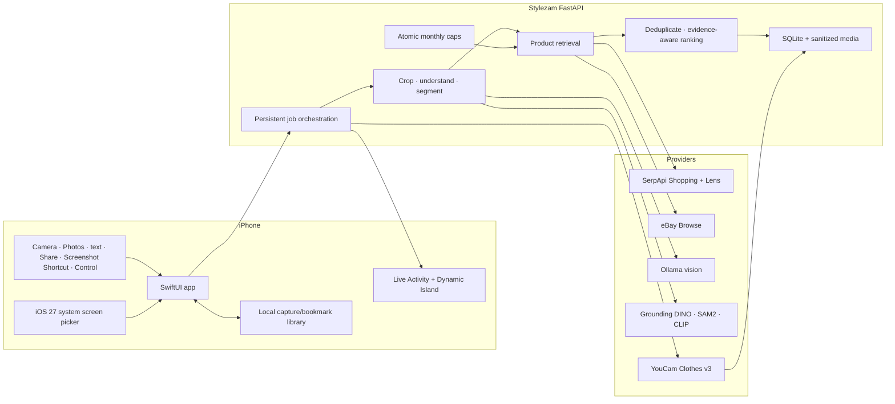

# Architecture

## Product boundary

Stylezam retrieves real merchant/listing data. The app may analyze pixels and rerank retrieved candidates, but it does not invent a product, price, merchant, offer, or “exact match.” Virtual try-on is presented as a visualization, never as a fit prediction.

## System flow

## Search lifecycle

1. The client sends text, a normalized JPEG, or both to `POST /v1/searches`.
2. The backend strips image metadata, transposes EXIF orientation, converts to RGB JPEG, and stores a randomized filename.
3. If enabled, Grounding DINO locates fashion objects and SAM2 isolates the primary item. A user-selected region takes precedence.
4. If enabled, Ollama emits strict structured attributes. Its prompt forbids unsupported brand guesses.
5. Each external retrieval call atomically claims one unit from Stylezam’s local monthly cap before executing.
6. SerpApi and/or eBay return actual source records. Provider failure is surfaced; zero successful routes is not treated as an empty shopping result.
7. CLIP can rerank the first visual candidates locally. Ranking combines provider evidence, visual similarity, and lexical similarity.
8. URLs are canonicalized, tracking parameters are removed, and duplicate listings are collapsed.
9. Results and job state are persisted. The iPhone polls the job and mirrors progress into a Live Activity.

Temporary user-selected and segmentation crops are deleted in a `finally` cleanup after retrieval/ranking, including failed or cancelled jobs. The original search image remains attached to the persisted job until the user deletes that capture.

## Evidence tiers

- `exact` requires an upstream exact-match signal plus a high combined score.
- `likely` means strong alignment without proof of an exact SKU.
- `similar` means important visual or textual attributes align.
- `inspired` means partial style overlap only.

Every tier remains an inference. The product screen tells the user to confirm details on the merchant page.

## Capture outside the app

- The Control Widget and Action Button run an App Intent, write a timestamp to the shared app group, and open Stylezam.
- The `Search Image with Stylezam` App Intent accepts the previous Shortcut action’s real image. The recommended iOS 26 Shortcut is `Take Screenshot` → `Search Image with Stylezam`.
- The Share extension saves one real image and/or text value to the shared app-group container, then opens `stylezam://import`.
- With iOS 27 ScreenCaptureKit active, the app keeps up to 15 seconds of throttled frames in memory and favors the frame from just before the Control Center tap. Without a valid authorized frame it opens the normal capture sheet.
- Live screen is intentionally not a permanent app tab. Configuration/status live in Settings; selection is Apple system UI.

## Persistence and deletion

SQLite persists job state so queued jobs can recover after a backend restart. Generated YouCam output is copied into Stylezam storage before its provider URL expires. The person photo on the Stylezam backend is removed when try-on processing completes or fails. The iPhone downloads a completed preview locally and calls `DELETE /v1/try-ons/{id}` to remove the remaining Stylezam job/result. Search and try-on delete endpoints cancel active work, remove database rows, and remove associated local media. Local capture deletion calls the search delete endpoint on a best-effort basis.

## API surface

- `GET /v1/health`
- `GET /v1/capabilities`
- `POST /v1/searches`
- `GET /v1/searches/{id}`
- `GET /v1/searches/{id}/results`
- `DELETE /v1/searches/{id}`
- `POST /v1/try-ons`
- `GET /v1/try-ons/{id}`
- `DELETE /v1/try-ons/{id}`
- `GET /media/{filename}`

The generated OpenAPI interface is available at `/docs`.
