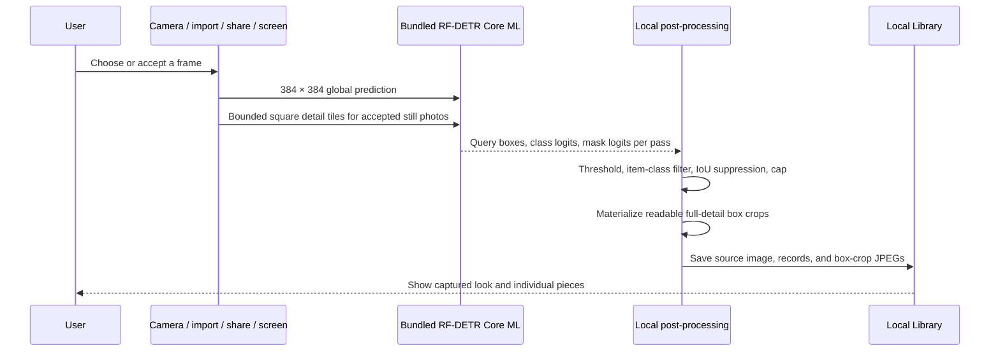

# Architecture

## Current boundary

Stylezam implements local fashion capture, garment instance detection, crop creation, inspection, persistence, and explicitly triggered product retrieval. Virtual try-on remains deferred.

## Capture data flow

No camera frame or accepted photo is sent during detection. A selected garment crop leaves the device only after the user starts a product search or asks the image-aware assistant.

## Product search data flow

The default private developer route is:

1. persist a logical search reservation before networking;
2. send the selected crop directly to Lykdat Global Search;
3. select the provider result group that best matches the chosen local garment label;
4. normalize, cap, display, and persist the real provider results.

Stylezam AI is separate: a question sends the selected crop and user prompt to Fireworks Qwen 3.7 Plus. Only when the user explicitly converts a question or suggestion into a similar-product search does Stylezam send one generated text query—not the photo—to Serper shopping.

The default is one successful product search per garment. Logical reservations and provider counts survive relaunches. Failed requests remain in the diagnostic ledger because providers may still count them, but they do not consume the user's successful-search allowance and can be retried.

Lykdat Global Search accepts binary image data. SearchAPI.io and SerpApi Google Lens accept public image URLs, so Stylezam refuses to publish a private crop automatically. The Bright Data adapter requires a user-created compatible SERP zone and token and remains unavailable until both exist.

## Inputs

The custom AVFoundation camera owns preview, rear/front switching, flash, manual shutter, and Live mode. Photos, clipboard images, App Intents, Share input, and an authorized iOS 27 screen frame converge on `AppModel.processCapture`.

The Share and cross-process control paths require the same App Group entitlement across signed targets. A Personal Team can test the main app but may not provision every extension capability.

## Bundled Core ML model

`App/Resources/Models/StylezamGarmentSegmentation.mlpackage` is part of the application resources. Xcode compiles it to `StylezamGarmentSegmentation.mlmodelc` while building the app. `ModelPackManager` resolves the compiled resource and loads the adjacent verified manifest; it has no downloader, network monitor, staging directory, or removable model state.

The model accepts a `1 × 3 × 384 × 384` normalized tensor and produces query boxes, class logits, and masks. Stylezam:

1. scores Fashionpedia item classes 0–26;
2. rejects confidence below 0.35 and very small boxes;
3. suppresses high-IoU duplicate boxes of the same class;
4. keeps the configured maximum, five by default and 12 at most;
5. creates a high-quality JPEG directly from the accepted source image for
   Library. Vision Inspector can separately materialize the raw transparent
   mask cutout for diagnosis.

The model object is cached by `GarmentVisionEngine` and configured with
`MLComputeUnits.cpuOnly`. Device verification found that this model export
returns all-zero class logits through the iOS GPU/Neural Engine path; CPU-only
execution returns the expected boxes and classes. Live preview and continuous
screen capture stay single-pass and skip mask-array materialization and crop
creation. Live preview uses a stricter 0.55 confidence threshold, rejects
near-identical competing boxes, and requires the same region and label to agree
across consecutive sampled frames. Once Live consensus is reached, AVFoundation
takes a full-quality still rather than saving the compact preview JPEG. Accepted
Photo and Live images add overlapping square detail passes when the source
resolution, power mode, thermal state, and remaining 9-second budget allow it.
Tile detections are projected into source coordinates, edge-clipped tile
results are rejected, and cross-scale duplicates are suppressed before the
configured item cap is applied.

## Live capture

Live mode samples preview frames rather than processing every camera frame. Candidate confidence, garment area, clipping, luminance, and sharpness contribute to capture guidance. A lightweight temporal tracker smooths boxes and only displays a category after two agreeing observations on the same region. Automatic capture requires three stable tracked signatures, a ready frame, and a cooldown. The shutter remains available at all times.

Recent Live and screen box crops use a perceptual dHash guard to suppress obvious repeats. These are deterministic capture heuristics, not biometric or identity recognition and not calibrated accuracy guarantees.

## Local persistence

The Library stores source images, readable garment box-crop JPEGs,
class/confidence/box records, capture source, and time under the app container.
The current raw mask is diagnostic-only because its iOS regions are not reliable
enough for a product-facing cutout. A bounded snapshot keeps the most recent
media. Deleting a scan removes its source and crop files; clearing Library
removes all local media and saved legacy records.

Live screen preview frames remain in a short in-memory rolling buffer. Stopping capture clears that buffer.

## Item coverage

The emitted item classes cover shirts/blouses, tops, sweaters, cardigans, jackets, vests, pants, shorts, skirts, coats, dresses, jumpsuits, capes, glasses, hats/head coverings, ties, gloves, watches, belts, leg warmers, tights/stockings, socks, shoes, bags/wallets, scarves, and umbrellas.

Part/detail classes such as sleeves, collars, pockets, zippers, and sequins are not emitted as separate Library pieces. Rings, bracelets, necklaces, and earrings require a future benchmarked accessory detector or explicit crop workflow.

## iOS 27 screen path

ScreenCaptureKit code is compiled only when the installed SDK exposes it. Apple’s system content-sharing picker supplies authorization; Stylezam cannot silently begin a display stream. Frames are throttled and buffered in memory. iOS owns the system privacy indicator, and Stylezam does not draw an imitation recording border over other apps.

## Failure behavior

- Missing or invalid bundled model: capture stops with a clear reinstall/build error; it does not silently switch to fabricated labels.
- No garment above threshold: the source can still be saved with zero pieces.
- Duplicate Live/screen item: no duplicate scan is added.
- Missing provider key/zone: no request is reserved or dispatched; Search names the missing configuration.
- Per-piece or monthly local limit reached: the request stops before networking.
- Dispatched provider failure: the attempt remains visible in Search Diagnostics and is not silently retried.
- iOS 26: screen capture reports unavailable; camera, Photos, clipboard, and Share paths continue.
